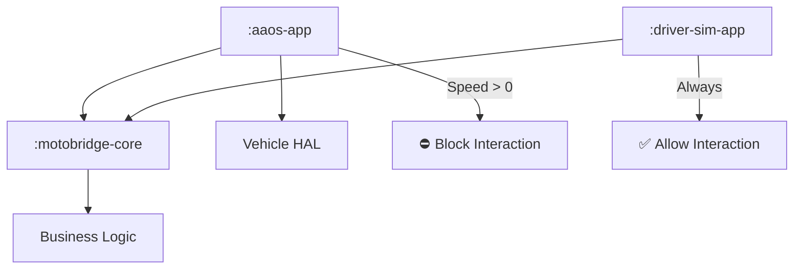

# 🏍️ MotoBridge-AAOS

**Platform-Agnostic Two-Wheeler Ride-Hailing Framework**

> **⚠️ Disclaimer**: Research PoC only. Not for production road use.

---

## 📖 Overview

**MotoBridge** solves the "Two-Screen Problem" for ride-hailing companies (Uber Moto, Rapido). It allows a **single driver app codebase** to run safely on both:
1.  📱 **Smartphones** (Unrestricted feature set)
2.  🛵 **Motorcycle Dashboards** (AAOS - Safety restricted)

This project demonstrates **Distraction Optimization (DO)**: automatically blocking complex interactions (like typing OTPs) when the vehicle is moving, without rewriting business logic.

---

## 🏗️ Architecture

We use a **"Core + Flavors"** architecture to separate Logic from Safety Rules.

### 🧩 Modules

| Module | Description |
| :--- | :--- |
| **🧠 `:motobridge-core`** | **The Brain**. Pure Kotlin. Contains state machine & logic. |
| **🛡️ `:aaos-app`** | **The Safe Client**. Android Automotive app. Enforces safety rules. |
| **📱 `:driver-sim-app`** | **The Mobile Client**. Standard Android app. Unrestricted. |
| **⚙️ `:vehicle`** | **The Hardware**. Mocks speed & ignition signals. |

---

## ⚡ Key Features

*   **🚫 Safety First**: Automatically disables typing/touch when moving.
*   **🔌 Mock HAL**: Simulates vehicle speed & gears without real hardware.
*   **👁️ Glanceable UI**: High-contrast, large-button interface for riders.
*   **🔋 Battery Efficient**: Throttle updates when ignition is OFF.

---

## 🚀 How to Run

1.  **Clone** the repo in Android Studio Iguana+.
2.  **Select Configuration**:
    *   Run **`driver-sim-app`** on a Phone Emulator for the full experience.
    *   Run **`aaos-app`** on an Automotive Emulator for the safe experience.
3.  **Simulate Driving**:
    *   In the AAOS app, click **"Simulate Drive"**.
    *   Try to accept a ride. Watch the **Safety Policy** block you! 🛑

---

## 📚 Learn More

*   [Android Automotive OS Docs](https://developer.android.com/cars)
*   [Car App Quality Guidelines](https://developer.android.com/docs/quality-guidelines/car-app-quality)
*   [Vehicle Hardware Abstraction Layer](https://source.android.com/docs/automotive/vhal)

---

**Built for Automotive Engineering Demonstrations**
